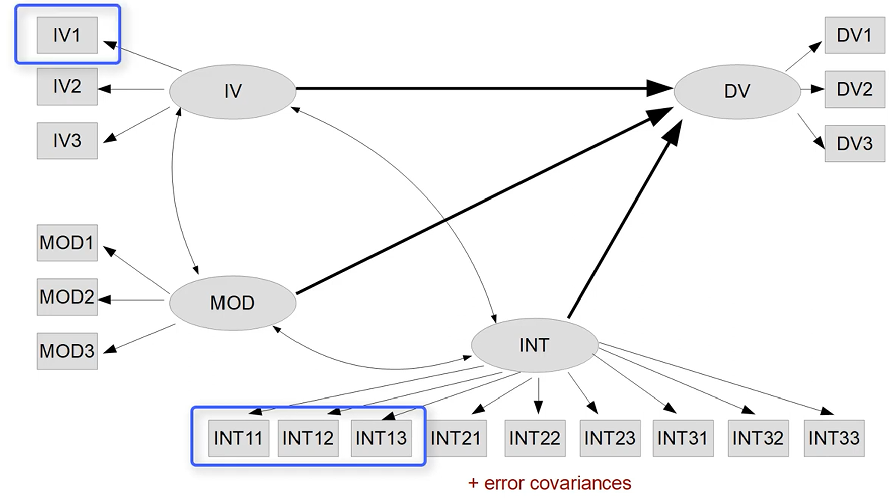
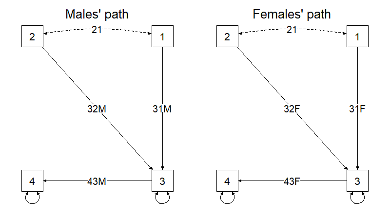

## Today

1.  Quick SEM/CFA refresher
2.  Observed moderation (simulation) with `lm()` and `lavaan`
3.  Why “SEM interactions” (latent interactions) are worth the trouble
4.  The main technical difficulties (what breaks, why)
5.  Options in practice: PI (dblcent) vs LMS/QML (and what to report)

::: callout-tip
**Measurement-first reminder:** validate the *measurement model* (CFA) before fitting any interaction...or anything in general!
:::

------------------------------------------------------------------------

## Learning objectives

By the end of this deck, you can:

-   Simulate a simple moderation with latent variables and observed indicators
-   Fit observed moderation via `lm()` and via `lavaan::sem()`
-   Explain *why* latent interactions are harder than observed ones
-   Fit a latent interaction in `modsem` using:
    -   product-indicator (PI) approach: `method = "dblcent"`
    -   distribution-analytic approach: `method = "lms"` (and know what “qml” is)
-   Probe and visualize the interaction (simple slopes, JN, surface)

------------------------------------------------------------------------

## Minimal SEM/CFA refresher

**Core idea**

::::: {columns}
::: {.column width="50%"}
-   Latent construct $(\xi)$ is measured by indicators $(x_1, x_2, x_3)$

$$
x_i = \lambda_i\,\xi + \delta_i
$$

-   **CFA**: estimate loadings $(\lambda)$ and measurement error $(\delta)$
-   **SEM**: add structural regressions among latent variables
:::

::: {.column width="50%"}

:::
:::::

------------------------------------------------------------------------

## Why measurement modeling matters for moderation

Observed moderation uses *measured variables*.

If the constructs are measured with error (and they always are):

-   Main effects attenuate
-   Interaction effects attenuate **even more**

**Intuition:** the product term is “signal × signal” but also “error × signal” and “error × error”.

::: callout-warning
Less precise measurements (higher error) decreases power \[NO PUBLICATIONS!\]! For interactions, power is already usually very low
:::

------------------------------------------------------------------------

## Simulation setup

We’ll simulate:

-   Outcome (latent): **achievement** (Y)
-   Predictor (latent): **intelligence** (X)
-   Moderator (latent): **anxiety** (Z)

Structural part (prediction of the outcome):

$$
Y = \beta_X X + \beta_Z Z + \beta_{XZ}(X\cdot Z) + \varepsilon
$$

Then we create **3 indicators per construct**.

------------------------------------------------------------------------

## Simulate latent variables

::: {style="font-size:0.5em; line-height:1.15;"}
```{r}
set.seed(123)

# ----------------------
# Design choices
# ----------------------
N <- 500

# Structural effects (interpretable):
# - intelligence helps achievement
# - anxiety hurts achievement
# - anxiety reduces the benefit of intelligence (negative interaction)
b_X  <-  0.40
b_Z  <- -0.30
b_XZ <- -0.20

# Correlation between X and Z (optional)
rho_XZ <- -0.20

# Latent predictors (bivariate normal)
# We'll construct Z with the desired correlation with X
X <- rnorm(N, mean = 0, sd = 1)
E_Z <- rnorm(N, mean = 0, sd = 1)
Z <- rho_XZ * X + sqrt(1 - rho_XZ^2) * E_Z

XZ <- X * Z

# Latent outcome
lin <- b_X * X + b_Z * Z + b_XZ * XZ
var_lin <- var(lin)

# choose residual variance so that Var(Y) ~ 1
var_e <- max(1e-6, 1 - var_lin)
Y <- lin + rnorm(N, mean = 0, sd = sqrt(var_e))

c(var_X = var(X), var_Z = var(Z), var_XZ = var(XZ), var_Y = var(Y))
```
:::

------------------------------------------------------------------------

## Create observed indicators

We’ll use loadings $(\lambda)$ around .70–.80 (VERY GOOD ITEMS!)

::: {style="font-size:0.65em; line-height:1.15;"}
```{r}
# Loadings (can be different per construct if you want)
lambda_X <- c(.80, .70, .75)
lambda_Z <- c(.80, .70, .75)
lambda_Y <- c(.80, .70, .75)
# For standardized latent variables, choose residual variances so items are ~standardized
# Var(item) ≈ lambda^2 * Var(latent) + theta; with Var(latent)=1, set theta = 1 - lambda^2
theta_X <- 1 - lambda_X^2
theta_Z <- 1 - lambda_Z^2
theta_Y <- 1 - lambda_Y^2
# Intelligence indicators (explicit; no helper function)
int1 <- lambda_X[1] * X + rnorm(N, 0, sqrt(theta_X[1]))
int2 <- lambda_X[2] * X + rnorm(N, 0, sqrt(theta_X[2]))
int3 <- lambda_X[3] * X + rnorm(N, 0, sqrt(theta_X[3]))
# Anxiety indicators
anx1 <- lambda_Z[1] * Z + rnorm(N, 0, sqrt(theta_Z[1]))
anx2 <- lambda_Z[2] * Z + rnorm(N, 0, sqrt(theta_Z[2]))
anx3 <- lambda_Z[3] * Z + rnorm(N, 0, sqrt(theta_Z[3]))
# Achievement indicators
ach1 <- lambda_Y[1] * Y + rnorm(N, 0, sqrt(theta_Y[1]))
ach2 <- lambda_Y[2] * Y + rnorm(N, 0, sqrt(theta_Y[2]))
ach3 <- lambda_Y[3] * Y + rnorm(N, 0, sqrt(theta_Y[3]))

# Data frame of observed items
dat <- data.frame(
  int1 = int1, int2 = int2, int3 = int3,
  anx1 = anx1, anx2 = anx2, anx3 = anx3,
  ach1 = ach1, ach2 = ach2, ach3 = ach3
)
# head(dat)
```
:::

------------------------------------------------------------------------

## Observed totals (sum/mean scores)

:::::: {style="font-size:0.85em; line-height:1.15;"}

This is what many researchers do (sometimes without realizing the cost for interactions and their meaning from a latent perspective).

```{r}
dat$intelligence_total <- rowMeans(dat[, c("int1","int2","int3")])
dat$anxiety_total      <- rowMeans(dat[, c("anx1","anx2","anx3")])
dat$achievement_total  <- rowMeans(dat[, c("ach1","ach2","ach3")])

# Center for interpretability: Z = 0 means "average anxiety"
dat$int_c <- as.numeric(scale(dat$intelligence_total, scale = FALSE))
dat$anx_c <- as.numeric(scale(dat$anxiety_total,      scale = FALSE))

dat$int_x_anx <- dat$int_c * dat$anx_c

summary(dat[, c("intelligence_total","anxiety_total","achievement_total")])
```

::::::

::: callout-warning
Sum scores require many assumptions that we rarely test (e.g., equal loadings)
:::

------------------------------------------------------------------------

## Observed moderation with `lm()`

```{r}
fit_lm <- lm(achievement_total ~ int_c * anx_c , data = dat)
#            achievement_total ~ int_c + anx_c + int_x_anx
coef(summary(fit_lm))
```

Interpretation:

-   `int_c`: effect of intelligence when **anxiety is average** (0 after centering)
-   `anx_c`: effect of anxiety when intelligence is average
-   `int_x_anx`: *moderation* (how the effect of intelligence changes as anxiety increases)

------------------------------------------------------------------------

## Observed moderation with `lavaan::sem()`

Same regression, but estimated with SEM syntax.

```{r}
library(lavaan)

mod_obs <- '
  achievement_total ~ int_c + anx_c + int_c:anx_c 
# achievement_total ~ int_c + anx_c + int_x_anx
'

fit_obs <- sem(mod_obs, data = dat, meanstructure = TRUE)

pe <- parameterEstimates(fit_obs, standardized = TRUE)
pe[pe$op == "~", c("lhs","op","rhs","est","se","pvalue","std.all")]
```

::: callout-important
We can write the interaction part in two ways because the interaction term is actually a new variable given by the multiplication of the two predictors.
:::

------------------------------------------------------------------------

## Observed interaction is not “wrong”, but...

Observed moderation can be fine when:

-   variables are measured with high reliability
-   you’re comfortable treating totals as error-free
-   your goal is prediction, not latent construct inference

But in psychological measurement:

-   reliability is often moderate
-   measurement error is non-trivial
-   interaction effects are small → easily attenuated
-   measures are bound and not really continuous

------------------------------------------------------------------------

# SEM interactions and issues

------------------------------------------------------------------------

## SEM moderation = latent interaction

We want:

$$
\eta_Y = \beta_X\,\xi_X + \beta_Z\,\xi_Z + \beta_{XZ}(\xi_X\xi_Z) + \zeta
$$

**Problem**: $(\xi_X\xi_Z)$ is not observed.

Two main families of solutions:

1.  **Product indicators (PI):** build observed products (e.g., $(x_i z_j)$) and model them as indicators of a latent interaction factor.
2.  **LMS/QML (distribution-analytic):** estimate the interaction directly in the likelihood (no product indicators), but standard global fit indices typically disappear (we move away from covariance estimation).

::: callout-tip
`modsem` has multiple approaches available https://modsem.org/articles/methods.html
:::

------------------------------------------------------------------------

## The main technical issues

1)  **Nonlinearity**: interaction makes the model nonlinear

2)  **Non-normality**: product of normals is not normal

3)  **Fit logic changes**: especially with LMS (no classical $(\chi^2)$, CFI, RMSEA for the interaction model)

Everything else is a consequence: identification, centering confusion, computational burden, interpretation...but also better estimates, correct modelling...

------------------------------------------------------------------------

## Difficulty 1 — The product is latent (not observed)

In regression: compute $(XZ)$.

In SEM:

-   X and Z are latent
-   you only have indicators
-   product indicators contain extra error cross-terms

::: callout-tip
Product indicator means that we are multiplying each item of a scale with all other items, thus creating many other '*observed*' variables, which will form a '*new*' latent interaction measure.
:::

------------------------------------------------------------------------

## Difficulty 2 — Non-normality of the product

Even if $(X)$ and $(Z)$ are normal, $(XZ)$ is not.

```{r}
par(mfrow = c(1, 2))
hist(X,  main = "Latent X (normal)")
hist(XZ, main = "Latent X*Z (non-normal)")
par(mfrow = c(1, 1))
```

Implication: classical normal-theory SEs / tests can misbehave, especially in small N.

------------------------------------------------------------------------

## Difficulty 3 — Identification + parameter explosion (PI)

::::: {columns}
::: {.column width="50%"}
If $X$ has $(p)$ indicators and Z has $(q)$ indicators:

-   “all-pairs” product indicators: $(pq)$
-   many shared components → correlated residuals are plausible
-   too many free covariances can break identification
:::

::: {.column width="50%"}

:::
:::::

::: callout-warning
PI is transparent but can become a *big* model fast.
:::

------------------------------------------------------------------------

## Difficulty 4 — Fit indices disappear (LMS)

With LMS/QML you typically **cannot** report classical SEM global fit indices for the **interaction model**.

So evaluation becomes:

1.  Fit baseline model (no interaction): report CFI/TLI/RMSEA/SRMR there
2.  Add interaction: compare baseline vs interaction using **log-likelihood difference test** (or AIC/BIC)

This is a conceptual shift: fit ≠ truth, and sometimes fit ≠ available.

::: callout-warning
With PI fit indices remain, but non-normality issues too. Consider using robust fit indices.
:::

::: callout-tip
LMS/QML are estimated with distribution-analytic likelihood methods (integration / EM-type routines) and the interaction model is not evaluated using the standard “fit covariance matrix $𝑆$ with $Σ(θ)$” machinery.
:::

------------------------------------------------------------------------

## Difficulty 5 — Interpretation is conditional (probing)

::::: {columns}
::: {.column width="65%"}
The simple slope of $X$ depends on $Z$:

$$
\frac{\partial Y}{\partial X} = \beta_X + \beta_{XZ} Z
$$

So there is no single “main effect” of X.

You must probe:

-   simple slopes (e.g., Z = -1, 0, +1 SD)
-   Johnson–Neyman region
-   surface plots
:::

::: {.column width="35%"}
```{r}
#| echo: false
set.seed(12)
library(ggplot2)
x = rnorm(1000)
y1 = .60*x + rnorm(1000)
y2 = .10*x + rnorm(1000)
y3 = -.10*x + rnorm(1000)
database <- data.frame(
  pred = c(y1,y2,y3),
  out = rep(x,3),
  group = rep(c("high","medium","low"), each=1000)
)
ggplot(database,aes(x=pred,y=out,color=group,group=group)) +
  geom_smooth() +
  coord_cartesian(xlim=c(-2,2))
```
:::
:::::

------------------------------------------------------------------------

## Difficulty 6 — Centering: interpretation vs estimation

**Interpretation:** $(\beta_X)$ is the effect of X when $(Z=0)$. Centering makes “0” meaningful (often the mean).

**Estimation (PI):** centering indicators/products helps separate lower-order and interaction variance and stabilizes the model.

Rule of thumb:

-   PI methods: use **double-mean centering** (e.g., `dblcent`)
-   LMS/QML: focus on interpretability (what does Z=0 mean?) and probe slopes

------------------------------------------------------------------------

## Difficulty 7 — Computation & power

-   interaction effects are typically smaller than main effects
-   larger N needed for stable detection
-   PI: bigger model → more convergence problems
-   LMS/QML: numerical integration / iterative routines → slower, sometimes fragile

**Evaluate:** always report convergence, warnings, and sensitivity checks.

------------------------------------------------------------------------

# Solutions?

------------------------------------------------------------------------

## Option 0 — “Observed proxies” (baseline)

-   totals / sum scores
-   factor-score regression

Pros:

-   simple and familiar

Cons:

-   treats measurement error as absent or “handled” by factor scores
-   interaction often attenuates

------------------------------------------------------------------------

## Option 1 — Latent interaction via product indicators (PI)

:::::: {style="font-size:0.85em; line-height:1.15;"}

**Idea:** create product indicators and treat them as indicators of a latent interaction factor.

Common centering tricks:

-   mean-centering indicators
-   **double-mean centering** (default)
-   residual centering (advanced; changes meaning)

Pros:

-   classic SEM machinery applies (often fit indices available)

Cons:

-   parameter heavy
-   identification + correlated residual decisions

::::::

------------------------------------------------------------------------

## Option 2 — Latent Moderated Structural Equations (LMS)

**Idea:** estimate $(XZ)$ in the likelihood (no product indicators).

Pros:

-   elegant, avoids product-indicator explosion
-   supports \*\*higher-order\*\* interactions

Cons:

-   classical global fit indices typically not available for interaction model
-   must use baseline fit + LRT / IC

------------------------------------------------------------------------

## Now: fit the latent interaction with `modsem`

We fit the same SEM twice:

-   **PI dblcent** (`method = "dblcent"`)
-   **LMS** (`method = "lms"`) and mention **QML**

[NOTE: You need the modsem package installed.]{style="color:#c00000; font-weight:700"}

------------------------------------------------------------------------

## Latent interaction with PI dblcent

::::: {columns}
::: {.column width="45%"}
**Baseline SEM (no interaction)**

```{r, eval=TRUE}
library(modsem)

model_base <- '
  intelligence =~ int1 + int2 + int3
  anxiety      =~ anx1 + anx2 + anx3
  achievement  =~ ach1 + ach2 + ach3

  achievement ~ intelligence + anxiety
'

fit_base <- modsem(model_base, data = dat)
# summary(fit_base)
```

Evaluate baseline fit (global + local) before adding interaction.
:::

::: {.column width="50%"}
**PI interaction**

```{r, eval=TRUE}
model_int <- '
  intelligence =~ int1 + int2 + int3
  anxiety      =~ anx1 + anx2 + anx3
  achievement  =~ ach1 + ach2 + ach3

  achievement ~ intelligence + anxiety +
                intelligence:anxiety
'

fit_dblcent <- modsem(model_int, 
        data = dat, method = "dblcent")
# summary(fit_dblcent)
```

Check LRT compared to baseline + convergence, sign/magnitude of interaction path, whether estimates are stable (SEs not exploding)

:::
:::::

------------------------------------------------------------------------

## Latent interaction with LMS (and QML)

```{r, eval=TRUE}
fit_lms <- modsem(model_int, data = dat, method = "lms")
fit_qml <- modsem(model_int, data = dat, method = "qml")

# summary(fit_lms)
# summary(fit_qml)
```

**Evaluate (LMS/QML):**

-   baseline model: classical fit indices
-   interaction model: compare log-likelihood vs baseline (LRT) and check AIC/BIC

------------------------------------------------------------------------

## Plots

```{r}
p <- plot_interaction(x = "intelligence", z = "anxiety", 
                      y = "achievement", vals_z = c(-1, 1), 
                      model = fit_lms)
p
```

------------------------------------------------------------------------

## LMS evaluation: baseline fit + LRT 

```{r}
#| eval: true
# pseudo-code: exact methods depend on the object class and available methods

fit_lms <- modsem(model_int, data = dat, method = "lms")
fit_base <- estimate_h0(fit_lms, calc.se = FALSE)

compare_fit(est_h1 = fit_lms, est_h0 = fit_base)


```

::: callout-important
**Teaching point:** don’t “evaluate fit” of the interaction model using missing CFI/RMSEA. Use baseline fit (this should be good) + LRT logic.
:::

------------------------------------------------------------------------

## Summary

```{r}
#| echo: false

library(dplyr)
library(tidyr)
library(purrr)
library(knitr)

## observed variables model
mod_obs <- '
  achievement_total ~ int_c + anx_c + int_x_anx
'

fit_obs <- sem(mod_obs, data = dat, meanstructure = TRUE)

extract_obs_paths <- function(fit, model_label) {
  pe <- parameterEstimates(fit, standardized = TRUE)

  pe %>%
    filter(op == "~", lhs == "achievement_total") %>%
    mutate(
      model = model_label,
      term = case_when(
        rhs == "int_c" ~ "intelligence",
        rhs == "anx_c" ~ "anxiety",
        rhs == "int_x_anx" ~ "intelligence:anxiety",
        TRUE ~ rhs
      )
    ) %>%
    transmute(
      model, term,
      est = est, se = se,
      z = z, p = pvalue
    )
}

# Helper: pick the first column that exists (because names differ a bit across outputs)
pick_col <- function(df, candidates) {
  hit <- candidates[candidates %in% names(df)]
  if (length(hit) == 0) NA_character_ else hit[1]
}

extract_reg_paths <- function(fit, model_label) {
  pe <- modsem::parameter_estimates(fit)
  #pe <- modsem::standardized_estimates(fit)

  se_col <- pick_col(pe, c("std.error", "se"))
  p_col  <- pick_col(pe, c("p.value", "pvalue"))
  z_col  <- pick_col(pe, c("z", "statistic"))

  out <- pe %>%
    filter(op == "~", lhs == "achievement") %>%
    # keep intelligence, anxiety, and the interaction (which might have different naming)
    filter(rhs %in% c("intelligence", "anxiety") | grepl("intelligence.*anxiety", rhs)) %>%
    mutate(
      model = model_label,
      term  = case_when(
        rhs %in% c("intelligence", "anxiety") ~ rhs,
        TRUE ~ "intelligence:anxiety"
      ),
      se = if (!is.na(se_col)) .data[[se_col]] else NA_real_,
      p  = if (!is.na(p_col))  .data[[p_col]]  else NA_real_,
      z  = if (!is.na(z_col))  .data[[z_col]]  else NA_real_
    ) %>%
    select(model, term, est, se, z, p)

  out
}

# ---- collect the 4 models
paths_long <- bind_rows(
  extract_obs_paths(fit_obs, "Observed sum-scores (lavaan)"),
  extract_reg_paths(fit_base,    "Baseline (no interaction)"),
  extract_reg_paths(fit_dblcent, "PI dblcent"),
  extract_reg_paths(fit_lms,     "LMS"),
  extract_reg_paths(fit_qml,     "QML")
)

# Pretty "Estimate (SE)" table (wide)
paths_wide <- paths_long %>%
  mutate(est_se = sprintf("%.3f (%.3f)", est, se)) %>%
  select(model, term, est_se) %>%
  pivot_wider(names_from = term, values_from = est_se)

kable(paths_wide, caption = "Regression paths to achievement across models (Estimate (SE)).")
```

------------------------------------------------------------------------

## Who's best? A simple simulation

:::::: {style="font-size:0.5em; line-height:1.15;"}
::::: {columns}
::: {.column width="40%"}
```{r}
# simulation parameters
R <- 500; N <- 400; rho_xz <- 0.30
beta_x  <- 0.30; beta_z  <- 0.30 
beta_xz <- 0.20  # <-- ground 
lambda_int <- c(.80, .70, .75); 
lambda_anx <- c(.80, .70, .75)
lambda_ach <- c(.80, .70, .75)
```
:::

::: {.column width="60%"}
```{r}
#| echo: false

# saveRDS(results, file = "../data/results_latent_interactions.rds")
results <- readRDS("../data/results_latent_interactions.rds")
beta_xz <- 0.20  # <-- ground truth interaction
```

```{r}
#| echo: false

summ <- results %>%
  group_by(model) %>%
  summarise(
#    n_total = n(),
#    n_ok    = sum(ok, na.rm = TRUE),
#    conv_rate = mean(ok, na.rm = TRUE),
    
    mean_est = mean(est, na.rm = TRUE),
    sd_est   = sd(est, na.rm = TRUE),
    bias     = mean(est - beta_true, na.rm = TRUE),
    rmse     = sqrt(mean((est - beta_true)^2, na.rm = TRUE)),
    
    mean_se  = mean(se, na.rm = TRUE),
    power_p  = mean(p < .05, na.rm = TRUE),
    .groups = "drop"
  )

summ2 <- summ %>%
  mutate(across(where(is.numeric), ~ round(.x, 2)))

knitr::kable(summ2, caption = "Interaction estimate across methods")

```
:::
:::::

```{r}
#| echo: false
#| message: false

library(ggplot2)
ggplot(results %>% filter(!is.na(est)),
       aes(x = est)) +
  geom_histogram(bins = 30) +
  geom_vline(xintercept = beta_xz, linetype = 2, linewidth = 0.8) +
  facet_wrap(~ model, scales = "free_y", ncol = 1) +
  labs(
    # title = "Sampling distribution of the interaction estimate across methods",
    # subtitle = paste0("Dashed line = ground truth beta_xz = ", beta_xz),
    x = "Estimated interaction (b_XZ)",
    y = "Count"
  )
```
::::::

------------------------------------------------------------------------

## Probing the interaction (simple slopes, JN, surface)

```{r, eval=TRUE}
# Probing works directly on modsem fits

# simple_slopes(model = fit_lms, x = "intelligence", z = "anxiety", y = "achievement")
# plot_surface(model = fit_lms, x = "intelligence", z = "anxiety", y = "achievement")

plot_jn(model = fit_lms, x = "intelligence", z = "anxiety", y = "achievement")

```

------------------------------------------------------------------------

## “Under the hood”: product indicators with semTools + lavaan

::: {style="font-size:0.5em; line-height:1.15;"}
```{r, eval=FALSE}
library(semTools)

# matched-pair products, double-mean centered
# (x1*z1, x2*z2, x3*z3)
dat_pi <- indProd(
  data = dat,
  var1 = c("int1","int2","int3"),
  var2 = c("anx1","anx2","anx3"),
  match = TRUE,
  meanC = TRUE,
  doubleMC = TRUE
)

prod_names <- grep("^int[1-3].*anx[1-3]$", names(dat_pi), value = TRUE)

model_pi <- paste0('
  intelligence =~ int1 + int2 + int3
  anxiety      =~ anx1 + anx2 + anx3
  achievement  =~ ach1 + ach2 + ach3

  intxn =~ ', paste(prod_names, collapse = " + "), '

  achievement ~ intelligence + anxiety + intxn
')

fit_pi <- lavaan::sem(model_pi, data = dat_pi, meanstructure = TRUE)
summary(fit_pi, fit.measures = TRUE, standardized = TRUE)
```
:::

------------------------------------------------------------------------

## Reporting checklist (minimal)

1)  **Measurement (baseline):** CFA/SEM fit (CFI/TLI/RMSEA/SRMR) + key loadings

2)  **Interaction method:** PI (dblcent) or LMS/QML (and why)

3)  **Evaluation:**

-   PI: report SEM fit indices (if available) + local diagnostics
-   LMS/QML: baseline fit indices + LRT (ΔlogLik) or AIC/BIC

4)  **Effect reporting:** $(\hat\beta_{XZ})$, SE/CI, probing results (simple slopes / JN)

5)  **Transparency:** centering decisions and what “0” means for the moderator

------------------------------------------------------------------------

# Interactions as MG-CFA

------------------------------------------------------------------------

## Group comparisons (classic mg-cfa)

When the interaction term is not a continuous \[latent\] variable, we can run interactions using MG-CFA (slides [here](https://feracotommaso.github.io/SEM-phd-course/slides/07_invariance_mgcfa_partialinvariance.html##/structural-invariance))

{width="78%"}

```{r}
#| eval: false
m.med=sem(model,data,group="sex",
          group.equal=c("loadings","intercepts",
                        "regressions" # <---------- #
                        )
          )
```

------------------------------------------------------------------------

## Group comparisons (handmade mg-cfa)

```{r}
#| echo: false
dat$sex <- rbinom(nrow(dat),1,.50)
```

::::: {columns}
::: {.column width="50%"}
```{r}
#| eval: true
model_equal <- '
# measurement
intelligence =~ int1 + int2 + int3
achievement  =~ ach1 + ach2 + ach3

# structural path
achievement ~ c(b,b)*intelligence
'
fit_equal <- sem(model_equal, data = dat, 
                 group = "sex")
```
:::

::: {.column width="50%"}
```{r}
#| eval: true
model_free <- '
# measurement
intelligence =~ int1 + int2 + int3
achievement  =~ ach1 + ach2 + ach3

# structural path
achievement ~ c(b_m, b_f)*intelligence
'
fit_free <- sem(model_free, data = dat, 
                group = "sex")
```
:::
:::::

```{r}
anova(fit_equal, fit_free)
```

------------------------------------------------------------------------

## Take-home: 3 things

1.  Latent interactions are hard because the product term introduces **nonlinearity + non-normality**.
2.  **PI dblcent** is transparent (and often provides classic fit machinery) but can be heavy/fragile.
3.  **LMS/QML** are elegant for estimation, but they force a new evaluation mindset: **baseline fit + LRT**, plus probing for interpretation.

------------------------------------------------------------------------

## Further reading / self-study links

-   `modsem` documentation and vignettes (https://modsem.org/articles/modsem.html)
-   `modsem` R package documentation (product indicator methods; LMS/QML; probing functions)
-   semTools documentation for `indProd()`
-   Aiken, L. S., & West, S. G. (1991). *Multiple regression: Testing and interpreting interactions.*

## References {.tiny}

::: {#refs}
:::
