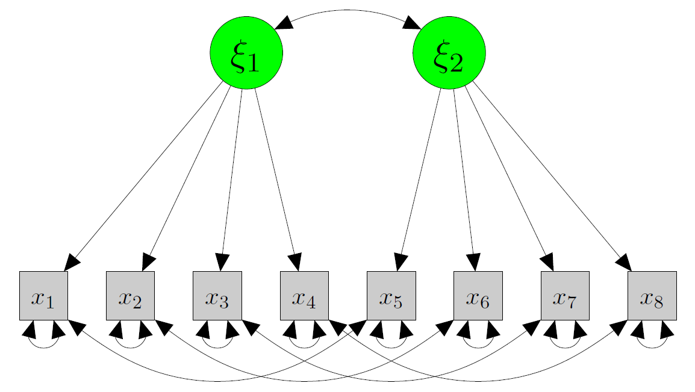
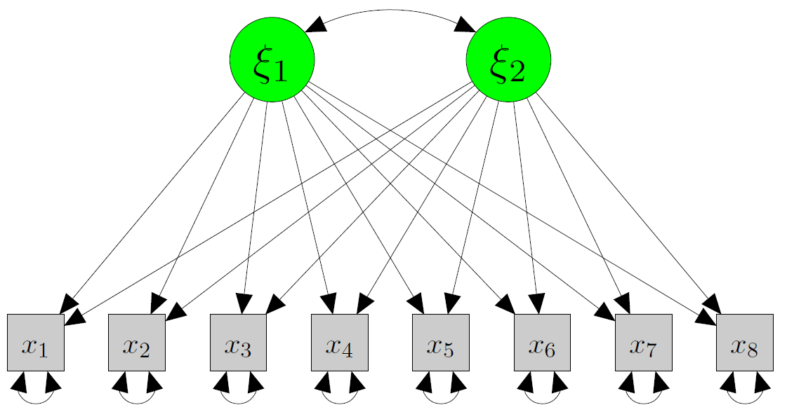
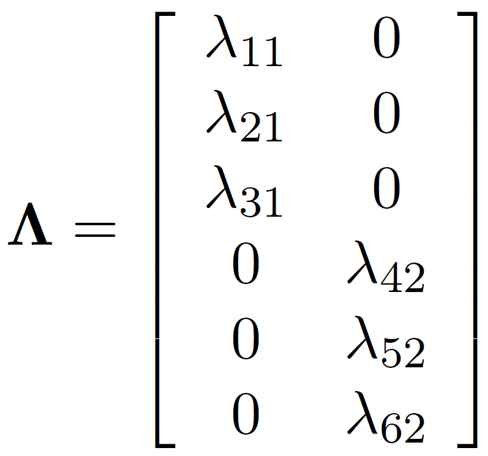
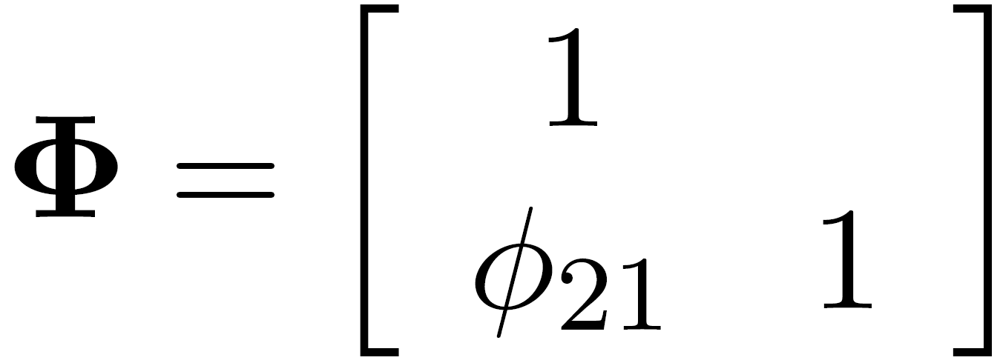
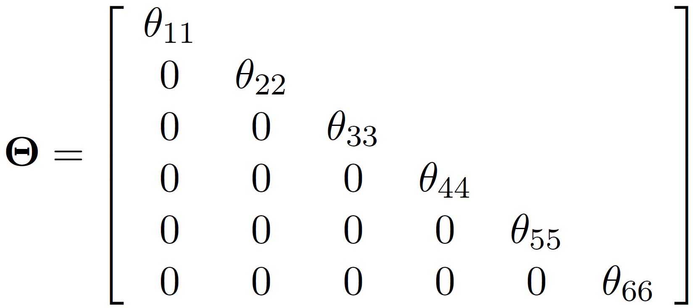
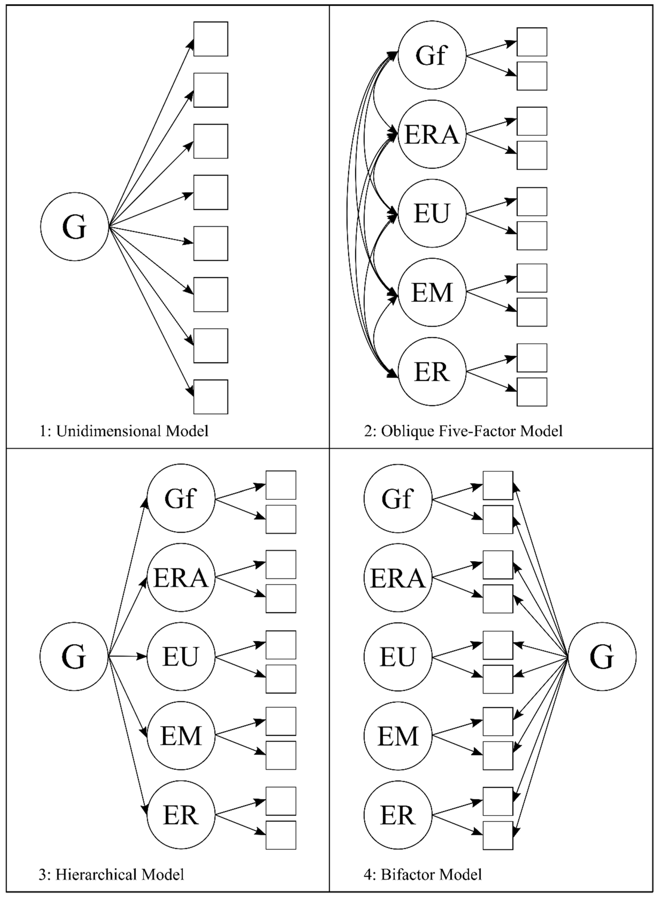
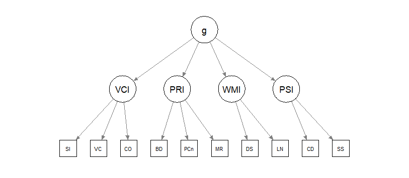
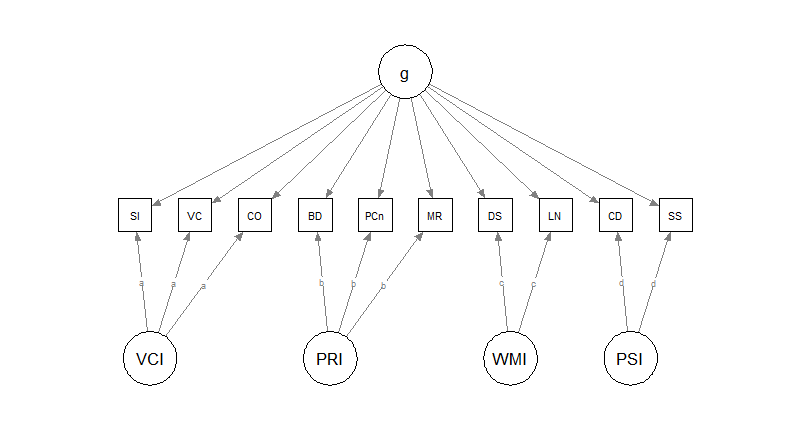

```{r}
#| label: setup
#| include: false
library(lavaan)
library(semTools)
options(digits = 3)
set.seed(12)
```

## Today in the workflow

**Specify → Identify → Estimate → Evaluate → Revise/Report**

::: {.callout-note appearance="minimal"}
**Today:** the *measurement* part — **CFA** (and reliability from CFA).  
**Two-step mindset:** measure first, then relate constructs (SEM deck 05).
:::

---

## Learning objectives

By the end of this session you should be able to:

- Explain the difference between **EFA** and **CFA** 
- Write the CFA measurement model in **equations and matrices**
- Understand **identification & scaling** (marker vs `std.lv`)
- Fit CFA models in **lavaan** and interpret loadings, factor correlations, and residual variances
- Use **local diagnostics** in CFA (residuals, MI/EPC) without “fit hacking”
- Compute and report **reliability** from CFA (ω-family; and (briefly) bifactor implications)

---

## Outline

- Factor analysis: what problem are we solving?
- EFA vs CFA (confirmatory stance)
- CFA model: equations, matrices, implied covariance
- Identification and constraints (scaling + rules)
- CFA in R (`lavaan`) + interpretation
- Reliability from CFA
- Bifactor model

---

## Factor analysis

:::{.callout-important}
Factor analysis models believe that *a small number of latent dimensions* explain systematic covariance among many observed variables.
:::

{width="70%"}

:::{.callout-warning}
**PCA** is not a factor analysis. It does not assume the 'existence' of any latent trait.
:::

---

## Exploratory Factor Analysis (EFA)

EFA: discover a plausible loading pattern.

- loadings are “free” (rotation chooses a representation)
- useful for exploration and item development
- weak theory → eavily exploratory

{width="75%"}

---

## Confirmatory Factor Analysis (CFA)

CFA: test a *specific* measurement hypothesis.

- you specify which loadings are **zero** vs **free**
- you can impose constraints (equal loadings, orthogonality, hierarchies)
- fit and diagnostics evaluate a theoretically constrained model

{width="75%"}

::: {.callout-warning appearance="minimal"}
CFA is not a fancy EFA: it is a **confirmatory** claim with theoretical assumptions and meanings.
:::

---

## General formula

The general CFA model can be written as:

$$
\begin{aligned}
\mathbf{x} &= \mathbf{\Lambda}_x\,\mathbf{\xi} + \mathbf{\delta} \\
\mathbf{y} &= \mathbf{\Lambda}_y\,\mathbf{\eta} + \mathbf{\epsilon}
\end{aligned}
$$

where $(\mathbf{x})$ and $(\mathbf{y})$ are observed variables, $(\mathbf{\xi})$ and $(\mathbf{\eta})$ are latent factors, and $(\mathbf{\delta})$ and $(\mathbf{\epsilon})$ are errors of measurement.

---

## The general formula explained (scalar form)

$$
\begin{aligned}
y &= b_0 + b_1 x + \epsilon \\
y_1 &= \tau_1 + \lambda_1\eta + \epsilon_1
\end{aligned}
$$

$$
\begin{bmatrix}
  y_1 \\
  y_2 \\
  y_3
\end{bmatrix}
=
\begin{bmatrix}
  \tau_1 \\
  \tau_2 \\
  \tau_3
\end{bmatrix}
+
\begin{bmatrix}
  \lambda_1 \\
  \lambda_2 \\
  \lambda_3
\end{bmatrix}
(\eta_1)
+
\begin{bmatrix}
  \epsilon_1 \\
  \epsilon_2 \\
  \epsilon_3
\end{bmatrix}
$$

---

## Measurement-first implications (reflective realism)

When we draw $(\mathbf{\Lambda})$ ($(\Rightarrow)$) from latent to observed, we assume reflective latent variables:

- **ARROWS are ARROWS**: the construct affects responses
- “realist” interpretation: the latent variable is something that *exists* (at least as a stable attribute)
- observed scores = construct signal + measurement error

Pragmatic “just a summary” interpretations are *not* neutral: they imply different measurement models (PCA/EGA/…).

::: {.callout-important}
Asserting that a latent variable 'exists' does not imply that there is one and only one entity/factor explaining the observations. A multitude, even millions, of factors (e.g., genes, ses, environment, health) can form the latent variable
:::

---

## The implied covariance (the single most important equation)

<div style="font-size:0.75em; line-height:1.15;">

For a standard CFA with latent covariance $(\Phi)$ and residual covariance $(\Theta)$:

$$
\Sigma = \Lambda \Phi \Lambda' + \Theta
$$

This is why:

- loadings $(\Lambda)$ and factor correlations $(\Phi)$ jointly shape observed covariances
- correlated residuals (off-diagonal $(\Theta)$) are **extra** covariance not explained by factors


::: {.columns}
::: {.column width="31%"}
Lambda: matrix of loadings

{width="90%"}
:::

::: {.column width="31%"}
Phi: latent variance-covariance matrix

{width="70%"}
:::

::: {.column width="31%"}
Theta: residual variance-covariance matrix

{width="100%"}
:::
:::

</div>

---

# CFA models

---

## CFA “model families”

:::{columns}
:::{.column width="50%"}

Key design choices:

- one factor vs multiple factors
- are factors correlated?
- orthogonal vs oblique
- hierarchical / second-order?
- bifactor structure?

All have statistical **and** theoretical consequences.

:::
:::{.column width="50%"}

{width="100%"}
:::
:::

---

```{r}
#| echo: false
#| message: false
#| warning: false
# Simulated data for clean diagrams
d_sim <- simulateData(
  model = "l1 =~ .75*x1 + .82*x2 + .77*x3
           l2 =~ .75*x4 + .82*x5 + .77*x6
           l1 ~~ .30*l2",
  sample.nobs = 429,
  seed = 12
)
```

## One-factor model

```{r}
#| echo: false
#| fig-height: 4
#| fig-width: 7
fit1 <- cfa("l1 =~ x1 + x2 + x3", data = d_sim)
semPlot::semPaths(
  fit1, edge.label.cex = 2,
  sizeMan = 11, sizeLat = 11,
  edge.color = "black", edge.label.color = "black"
)
```

---

## Two-factor model (correlated factors)

```{r}
#| echo: false
#| fig-height: 4
#| fig-width: 7
fit2 <- cfa("l1 =~ x1 + x2 + x3
             l2 =~ x4 + x5 + x6
             l1 ~~ l2", data = d_sim)
semPlot::semPaths(
  fit2, edge.label.cex = 2,
  sizeMan = 11, sizeLat = 11,
  edge.color = "black", edge.label.color = "black"
)
```

---

## Two-factor model (orthogonal factors)

```{r}
#| echo: false
#| fig-height: 4
#| fig-width: 7
fit2o <- cfa("l1 =~ x1 + x2 + x3
              l2 =~ x4 + x5 + x6
              l1 ~~ 0*l2", data = d_sim)
semPlot::semPaths(
  fit2o, edge.label.cex = 2,
  sizeMan = 11, sizeLat = 11,
  edge.color = "black", edge.label.color = "black", exoCov = FALSE
)
```

---

## Hierarchical model (second-order factor)

```{r}
#| echo: false
#| fig-height: 4
#| fig-width: 7
fitH <- sem("l1 =~ x1 + x2 + x3
             l2 =~ x4 + x5 + x6
             g  =~ l1 + l2", data = d_sim, std.lv = TRUE)
semPlot::semPaths(
  fitH, edge.label.cex = 1.7,
  sizeMan = 10, sizeLat = 10,
  edge.color = "black", edge.label.color = "black"
)
```

---

# R

---

## In R (lavaan grammar for CFA)

Core operator:

- `=~` defines a factor from its indicators

```{r}
#| eval: false
m <- '
  F1 =~ y1 + y2 + y3
  F2 =~ y4 + y5 + y6
  F1 ~~ F2          # factor covariance (oblique)
'

fit <- cfa(m, data = dat)  # or sem(m, data = dat)
summary(fit, standardized = TRUE, fit.measures = TRUE)
```

---

## Constraints (scaling)

To estimate latent-variable models, you must scale each factor. Two common strategies:

- Standardize latent variables: fix factor means to 0 and factor variances to 1 (`std.lv = TRUE`).
- Marker method: set one loading ($(\lambda)$) per factor to 1 (lavaan default).

```{r}
#| eval: false
fit <- cfa(m, data = dat, std.lv = TRUE) # Std latent variables
fit <- cfa(m, data = dat, std.lv = FALSE) # Marker method
```

---

## Constraints explained (marker vs standardization)

$$
\Sigma = \Lambda\Phi\Lambda' + \Theta
$$

::: {columns}
::: {.column width="50%"}

**Marker method** (fix one loading to 1)

```{r}
#| echo: false
#| fig-height: 3
#| fig-width: 5
fit_m <- cfa("l1 =~ x1 + x2 + x3", data = d_sim)
semPlot::semPaths(fit_m, edge.label.cex = 2, sizeMan = 11, sizeLat = 11,
                  edge.color = "black", edge.label.color = "black")
```

:::
::: {.column width="50%"}

**Standardization** (fix factor variance to 1)

```{r}
#| echo: false
#| fig-height: 3
#| fig-width: 5
fit_s <- cfa("l1 =~ x1 + x2 + x3", data = d_sim, std.lv = TRUE)
semPlot::semPaths(fit_s, edge.label.cex = 2, sizeMan = 11, sizeLat = 11,
                  edge.color = "black", edge.label.color = "black")
```

:::
:::

:::{.callout-note}
Scaling changes the *metric* of unstandardized loadings, not the implied covariance model.
:::

---

# Identification & evaluation

---

## Identification rules

For CFA, common identification rules include:

- the *t*-rule
- the Three-Indicator Rule
- the Two-Indicator Rule

---

## The *t*-rule

Necessary but not sufficient:

$$
t \leq \frac{q(q+1)}{2}
$$

where $(t)$ is the number of free parameters and $(q)$ the number of observed variables.

Intuition: the number of nonredundant elements in $(S)$ is the maximum number of “equations”; if unknowns exceed equations, identification is impossible.

---

## The Three-Indicator Rule

A sufficient (not necessary) condition (with diagonal $(\Theta)$):

1. One-factor model: at least **three** indicators with nonzero loadings.
2. Multifactor model is identified if:
   1. ≥ 3 indicators per factor
   2. each row of $(\Lambda)$ has one and only one nonzero element (simple structure)
   3. $(\Theta)$ is diagonal

---

## The Two-Indicator Rule

A sufficient (not necessary) condition for models with >1 factor:

- $(\Theta)$ diagonal
- each factor scaled (one $(\lambda)$ fixed to 1, or `std.lv=TRUE`)
- plus:
  1. ≥ 2 indicators per factor
  2. each row of $(\Lambda)$: one nonzero element
  3. $(\Theta)$ diagonal
  4. each row of $(\Phi)$ has at least one nonzero off-diagonal element

---

## CFA evaluation (see [deck 03](https://feracotommaso.github.io/SEM-phd-course/slides/03_model-fit_diagnostics_respecification.html#/title-slide){target="_blank"})

Global indices are the same as in deck 03 (χ², CFI/TLI, RMSEA+CI, SRMR).  
What becomes *CFA-specific* is local misfit interpretation:

- big residual **correlations** → local dependence / method effects / cross-loadings
- MI/EPC candidates typically propose:
  - **cross-loadings** (theory-threatening)
  - **correlated residuals** (requires a clear justification)
  - factor covariances / (rarely) indicator-level regressions

::: {.callout-warning}
Fit ≠ validity. “Improving fit” can destroy the meaning of a factor model if you add substantively implausible parameters.
:::

---

## A disciplined CFA respecification mindset

- First: check **items** (loadings, residual variances, signs)
- Then: check **patterns** (blocks of residual correlations)
- MI/EPC only after you have a *hypothesis* for the misfit
- Prefer fewer, theory-consistent modifications over many “small fixes”
- Report the respecification path transparently (what changed and why)

---

## Holzinger & Swineford (1939)

```{r}
#| echo: true
#| eval: true
dat <- HolzingerSwineford1939

m_hs <- '
  visual  =~ x1 + x2 + x3
  textual =~ x4 + x5 + x6
  speed   =~ x7 + x8 + x9
'
fit_hs <- cfa(m_hs, data = dat, std.lv = TRUE)
```

---

## Interpret loadings and factor correlations

```{r}
#| echo: true
#| eval: true
pe <- parameterEstimates(fit_hs, standardized = TRUE)
pe[pe$op %in% c("=~","~~") & pe$lhs %in% c("visual","textual","speed"),
   c("lhs","op","rhs","est","se","pvalue","std.all")]
```

---

## Reliability from CFA (ω family)

```{r}
#| echo: true
#| eval: false
reliability(fit_hs) # Deprecated :(
```

```{r}
compRelSEM(fit_hs)
AVE(fit_hs)
```


::: {.callout-note appearance="minimal"}
We emphasize ω-family (omega) reliability because it aligns with the CFA model; α is a special (often unrealistic) case.
:::

---

## Graphical representation

```{r}
#| echo: false
#| eval: true
semPlot::semPaths(
  fit_hs, what = "std", layout = "tree",
  residuals = FALSE, nCharNodes = 0,
  edge.label.cex = 0.9,
  sizeMan = 7, sizeLat = 8,
  edge.color = "black", edge.label.color = "black"
)
```

---

## A hierarchical intelligence example

Theory: test scores are affected by specific abilities (e.g., processing speed) that are influenced by an overarching factor ($g$).

{width="100%"}

::: {.callout-warning appearance="minimal"}
In practice, you should validate first-order abilities before jumping to a second-order model.
:::

---

## Second-order CFA (syntax template)

<div style="font-size:0.78em;">

```{r}
#| echo: true
N = 1000
mg <- "
VCI =~ .60*SI + .60*VC + .60*CO
PRI =~ .60*BD + .60*PCn + .60*MR
WMI =~ .60*DS + .60*LN
PSI =~ .60*CD + .60*SS
g   =~ .70*VCI + .70*PRI + .70*WMI + .70*PSI
"
datg <- simulateData(mg, N)
S<-cov(datg)
```


```{r}
#| eval: true
m2 <- "
VCI =~ SI + VC + CO
PRI =~ BD + PCn + MR
WMI =~ DS + LN
PSI =~ CD + SS
g   =~ VCI + PRI + WMI + PSI # HERE IS THE SECOND-ORDER
"
fit2 <- sem(m2, std.lv = TRUE, sample.cov = S, sample.nobs = N)

```

::: {.callout-note}
Note that we use `sample.cov` and `sample.nobs` arguments instead of `data`. In SEM you can fit the models from the covariance matrix and 'ignore' the raw data.
:::

</div>

---

## A second theoretical model: bifactor

Parallel theories: test scores are affected by a general factor ($g$) **and** by specific abilities that explain remaining variance.

**All factors are set to be orthogonal.**

{width="100%"}

---

## Bifactor model in R

```{r}
#| eval: true
mb <- "
VCI =~ a*SI + a*VC + a*CO
PRI =~ b*BD + b*PCn + b*MR
WMI =~ c*DS + c*LN
PSI =~ d*CD + d*SS
g   =~ SI + VC + CO + BD + PCn + MR + DS + LN + CD + SS
"

fitb <- sem(
  mb,
  orthogonal = TRUE, #!!!!!!
  std.lv = TRUE,
  sample.cov = S,
  sample.nobs = N
)
```

:::{.callout-note}
Note that loadings in bifactor models are often costrained to be equal within the same specific factors. This is done to ease convergence but should be justified and transparently reported.
:::

---

## Bifactor: interpretation requires diagnostics (not just fit)

Bifactor often improves fit by absorbing residual covariance.

```{r}
fitmeasures(fitb, fit.measures = c("cfi","rmsea","srmr"))
```

Before interpreting:

- is the general factor strong enough? (ECV / ωH / H)
- are specific factors meaningful or “junk factors”?
- do constraints (orthogonality, equal loadings) make sense?

::: {.callout-warning appearance="minimal"}
A bifactor model that “fits” can still be a *bad measurement story*.
:::

---

## Bifactor diagnostics: is there a strong general factor?

```{r}
#| echo: true
#| message: false
#| warning: false

library(BifactorIndicesCalculator)
bi <- bifactorIndices(fitb)

```

```{r}
#| echo: false
#| results: asis

library(knitr)
library(tibble)

mod_idx <- round(
  as.data.frame(t(bi$ModelLevelIndices)),
  3
)

knitr::kable(
  tibble::rownames_to_column(mod_idx, "Model"),
  align = c("l", "r", "r", "r", "r"),
  caption = "Model-level bifactor indices"
)
```

<div style="font-size:0.78em;">

ECV.g = proportion of common variance explained by the general factor.

PUC = proportion of correlations uncontaminated by overlap among specific factors.

Omega.g = reliability of the observed total score.

OmegaH.g = proportion of total-score variance attributable uniquely to g.

::: {.callout-warning}
Interpretation

These results do not support a strong general factor.

ECV.g = ~0.30: g explains only about 30% of common variance; 
OmegaH.g ~ 0.40: only about 40% of total-score variance is uniquely due to g.
PUC ~ 0.80 is fairly high, but high PUC does not rescue weak ECV.g and OmegaH.g.
:::

</div>

---

## Are the specific factors interpretable beyond g?

<div style="font-size:0.78em;">

```{r}
#| echo: false
#| results: asis

fac_idx <- round(
  bi$FactorLevelIndices[, c("ECV_SS", "ECV_GS", "Omega", "OmegaH", "H", "FD")],
  3
)

knitr::kable(
  fac_idx,
  align = c("l", rep("r", 6)),
  caption = "Factor-level bifactor indices"
)

```


**ECV_SS** = proportion of common variance in a factor’s own items due to that specific factor.

**ECV_GS** = proportion of common variance in those same items due to the general factor.

**Omega** = reliability of the observed factor score, counting all modeled common variance.

**OmegaH** = reliable variance attributable to the factor itself, net of the other factors.

**H** = construct replicability.

**FD** = factor determinacy, that is, how well factor scores are defined.

::: {.callout-note appearence = "minimal"}
Interpretation. For all four group factors, ECV_SS > ECV_GS: within each item cluster, the specific factor is stronger than g.
But OmegaH, H, and FD are modest for both the group factors and g: none appears especially strong or highly replicable.

Overall, the structure looks multidimensional, not essentially unidimensional.
:::

</div>

---

## Item-level evidence: do any items mainly reflect g?

:::{columns}
:::{.column width="28%"}

```{r}
#| echo: false
#| results: asis

item_idx <- round(
  bi$ItemLevelIndices[, "IECV", drop = FALSE],
  3
)

knitr::kable(
  item_idx,
  align = c("l", "r"),
  caption = "Item-level IECV values"
)
```

:::

:::{.column width="72%"}

IECV = proportion of an item’s common variance accounted for by the general factor.
High IECV means the item behaves mostly like an indicator of g.
Low IECV means the item retains substantial non-general variance.

::: {.callout-important}

Interpretation

Here, IECV values range from about 0.17 to 0.40.

No item behaves mainly as an indicator of the general factor.
The general factor is therefore not dominant at the item level.
This reinforces the earlier conclusion: the bifactor model does not justify treating the scale as essentially unidimensional.
:::

:::
:::

---

## Exercises (Lab 04)

Go to:

- **`labs/lab04_cfa_reliability_omegas.qmd`** [link](lab04_cfa_reliability_omegas.html){target="_blank"}

You will practice:

1. Fit and compare 1-factor vs correlated-factors CFA
2. Inspect local misfit (residual correlations + MI/EPC) with a theory filter
3. Compute reliability (ω) from CFA and report it
4. (Optional) Fit a bifactor model and evaluate interpretability (ωH / ECV)

---

## Take-home: 3 things

1. CFA is a **confirmatory** measurement claim: zeros and constraints are theory  
2. Identification/scaling is not a nuisance—it's the **metric** of your construct  
3. Reliability and validity are *model-based*: fit helps, but **fit ≠ validity**

---

## Further reading / self-study

- Classic SEM measurement chapters (CFA fundamentals; see course website reading list)

- **Maybe one day**

  - `extras/ex10_bifactor_esem_method-factors.qmd` — bifactor/ESEM/method factors (advanced)
  - `extras/ex05_miivs_factor-score-regression.qmd` — factor scores & regression (later)

---

## Acknowledgments

Thanks to Massimiliano Pastore for his slides!

{height="4.5cm"}

---

## References
